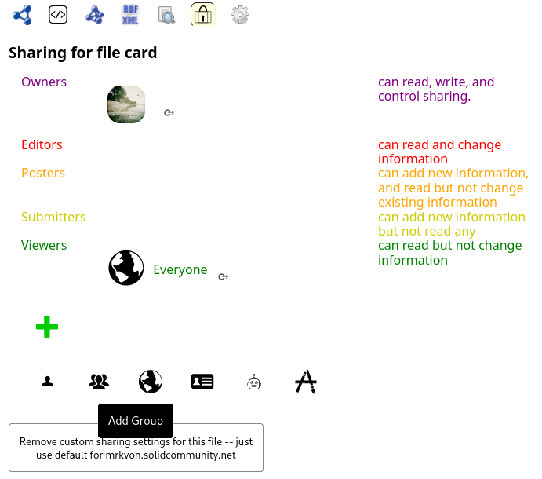

# Making a community

_Here we figure out how to make a group. We join the group. We find other people of the group. It becomes a hospex community._

We've put a pretty arbitrary data model together. We hope (without any foundation) that other developers, who publish and use data related to hospitality exchange, will somehow discover and use our data model, too. This is the elusive hope for interoperability.

---
## _Issue: Will anybody ever use our data model?_

_We certainly doubt so. But we push these worries aside and keep going. We vaguely imagine that developers could share their data models in a common repository, something like NPM, but for Linked Data Vocabularies... It would be easily searchable, and vocabularies could be discussed, and people would somehow, magically, come to an agreement about their data needs. There already exists the [Linked Open Vocabularies (LOV)](https://lov.linkeddata.es/dataset/lov/), but that doesn't seem to be enough._

_Well, now, as i'm writing this, i've [submitted](https://lov.linkeddata.es/dataset/lov/suggest) our [hospex vocabulary](http://w3id.org/hospex/ns) to LOV. Let's see if they accept and publish it there..._

---

## How do we find each other?

I can offer people a place to stay. But how do they ever find me? At the moment, our data live in different places, and we have no way to find each other. Internet is a vast place...

### 1. Crawl a network of friends of a friends

Well, people can ask (look at the profile of) their friends, and friends of friends, and friends of friends of friends, and so on, and see if somebody offers a place to stay; and where it is.
This would only work if the network of friends is dense and well established. But if i'm new to the network, or if somebody is new, they won't find me that way.

We could use a network of hospex contacts (To Be Done) to perform the same search.

#### Advantages

- We host people in our friends network, so we can feel safer with them
- We don't need any additional search system
- No centralized infrastructure that could be compromised at a risk of whole communities being lost

#### Disadvantages

- New people can't find others, and others can't find them
- Offers have to be public. Currently, Solid doesn't have any mechanism to give permissions to friends of friends of friends of friends, and nobody else. (We could make a crawler that for each user collects these "foafoafoafs" to a single group, traversing the graph to certain depth, and give permissions to that group (or rather request members of that group to give permission to read their data).)
- We don't have any notion of a Community (e.g. cyclists, hitchhikers, ...) - like [different](https://welcometomygarden.org/) [hospex](https://www.bewelcome.org/) [communities](https://www.facebook.com/groups/hostasister/), or different [Trustroots Circles](https://www.trustroots.org/circles) (could be done with "tags" stored in a profile)
- Search by location would require prior fetch and scan of a whole network of foafoafoafs, that would take waaaaaaay to long to be usable (scalability and app responsiveness issues) unless we cache that data locally but then it can get stale, needs refreshments, ... gets a bit complicated. A cache could be structured as a geospecial index though, specifically created for each user from their own network. That might be not that bad idea, actually.
- There is no common space to broadcast messages (invitations to stay or requests to be hosted), unless we had a wall of messages from foafoafoafs, stored locally and refreshed similarly as messages in SSB?

#### Other characteristics

- Networks may be disjoint (i.e. two or more disconnected groups), and therefore not know about each other, essentially making separate communities. Depending on the context, this can be desired or not.

### 2. Make a place to discover each other

Create a place (a group) where people can register/join. Members can see each other in this group.

Improvement #2.1: Make the group members searchable by location, creating a geo index

#### Advantages:
- People who previously didn't know each other can find each other
- Solid has a way of sharing permissions with groups of people - our data don't have to be public - we only share our offers with members of our community or communities (well, ehm, we'll see about that in a moment...)
- Belonging to something bigger then a single individual is, like a community, can be a source of an identity (in human, offline sense)

#### Disadvantages:
- Centralized solution for a community, a single point of failure, a single point of control. However:
  - if there were many independent communities like this (run on different servers by different people), and everyone was a member of a few, it becomes more decentralized. 
  - a group could be replicated, and an index could be distributed over a few nodes, with some redundancy.
- If we don't make _Improvement #2.1_, we have to fetch all members' offers in order to find hosts in the area we travel to


[comment]: <> (### 3. Make a distributed way to discover each other &#40;Distributed Hash Tables&#41;)

[comment]: <> (I don't think it would work actually. 
It is possible to have an index distributed over a few nodes, that could be queried by location. 
It is also possible to have a key-value store distributed over a few nodes, implemented as a distributed hash table, it would be queried by keys, not sure what they might be.
I suggest removing this point alltogether. )

### (both solutions can coexist next to each other)

---

These are all valid options. For starters we went for the latter option - making a centralized group to discover each other


## How to make a group

We hope to create a group such that

- Only group members can fetch the list of other members
- Some groups will be accepting everybody, others will be private - invitation only, or you apply for membership and somebody has to accept you
- I can decide to only share my offers with the members of the group, not with the whole world
- It's possible to leave the group

We've seen in some Solid Server user interfaces, that we can give permissions to a group, so we are hopeful



### Figuring out how Solid groups work

We tried to find examples of existing Solid groups, without much success. So we turned to [Solid specification](https://solidproject.org/TR/protocol), and here we've had more luck. The section [Authorization](https://solidproject.org/TR/protocol#authorization) directed us to [WAC specification](https://solidproject.org/TR/wac). There, we found notion of _[agent group](https://solidproject.org/TR/wac#agent-group)_, and finally, in a [section called Access Subjects](https://solidproject.org/TR/wac#access-subjects), we read

> The `acl:agentGroup` predicate denotes a group of agents being given the access permission. The object of an `acl:agentGroup` statement is an instance of `vcard:Group`, where the members of the group are specified with the `vcard:hasMember` predicate.

Great! So the group should look like

```ttl
@prefix : <#>.
@prefix vcard: <http://www.w3.org/2006/vcard/ns#>.
@prefix p1: <https://person1.inrupt.net/profile/card#>.
@prefix p2: <https://person2.solidcommunity.net/profile/card#>.
@prefix p3: <https://person3.solidweb.org/profile/card#>.
@prefix p4: <https://person4.org/profile/card#>.

:group
    a vcard:Group;
    vcard:hasMember p1:me, p2:me, p3:me, p4:me.
```

(remember how to read this? [Triples, triples, triples...](my-profile.md#triples-triples-triples))


### Testing the group out

Now, let's see if this actually works and if we can use it.

We want to:

1. Make a public group
    1. See if we can authorize the group members to access a resource
    1. See if others who are not a member of a group can see us but not a resources
1. Make the group private - self-referencing (The group can be viewed by members of itself)
    1. See if we can see other members of a group
    1. See if we can authorize the group members to access a resource
    1. See if others who are not a member of a group can not see us or a resources

Because ideally, the group members are visible only to each other, and can share their hosting offers only with each other.

And we're curious how different Solid Pod implementations handle this - NSS, CSS, ESS

We put a [detailed report into a separate document](group-test.md).

#### What did we learn?

Some results of this testing are hopeful, some a bit discouraging.

We've found that groups, as a concept, work. We've also encountered some [bugs](https://github.com/nodeSolidServer/node-solid-server/issues/1698), which can be fixed.

But unfortunately, private groups [probably don't work according to spec](https://github.com/CommunitySolidServer/CommunitySolidServer/issues/1442#issuecomment-1229842295). I've [pursued this](https://forum.solidproject.org/t/can-i-use-a-non-public-group-to-define-access-to-my-resources/4841) [question further](https://gitter.im/solid/specification?at=630cef82443b7927a7eaaa83), but it's disappointing.

Basically, at this point, the options are two:

1. Everybody in the internet can see the list of hospitality exchange members
2. Group is private, but the people's hospex data are public. ([this doesn't work if the group is hosted on CSS](https://github.com/CommunitySolidServer/CommunitySolidServer/issues/1442))

[comment]: <> (What if we had a functional webId for each hospex community, and we created a public Solid Group that included them and authorized only members of this group to see people's hospex data? Each community would have a separate app/webpage, with their own webId. Only app would be authorized to access hospex data of members of the community it serves. The members directly or other apps/communities would not be authorized to read that data.
Trust between communities could be established by granting or revoking access to resources of one community for the webId corresponding to the other community
Only the apps could write to hospex.ttl files and they could enforce and validate expected file format for the offers that belong to them, a format that would be specific to them and they would have freedom to change and maintain it)

We chose the second option to start. But it's a difficult choice, two suboptimal options...

### Finally, making it

We made the following data design for a group:


And we added 2 new words to our hospex vocabulary: [memberOf](http://w3id.org/hospex/ns#memberOf), and [Community](http://w3id.org/hospex/ns#Community).

Let's make a public document with community name and description, and a private document with community members.

#### The public part

Make [this document](https://mrkvon.inrupt.net/hospex/sleepy-bike/community#us):

```ttl
@prefix : <#>.
@prefix sioc: <http://rdfs.org/sioc/ns#>.
@prefix mem: <members#>.

:us
    a sioc:Community;
    sioc:about
    "Sleepy Bike is a hospitality exchange community for cyclists"@en;
    sioc:has_usergroup mem:group;
    sioc:name "Ospal\u00e9 kolo"@cs, "Sleepy Bike"@en.
```

and make it **public** with the following [.acl](https://mrkvon.inrupt.net/hospex/sleepy-bike/community.acl)

```ttl
@prefix : <#>.
@prefix acl: <http://www.w3.org/ns/auth/acl#>.
@prefix foaf: <http://xmlns.com/foaf/0.1/>.
@prefix sle: <./>.
@prefix c: </profile/card#>.

:ControlReadWrite
    a acl:Authorization;
    acl:accessTo sle:community;
    acl:agent c:me;
    acl:mode acl:Control, acl:Read, acl:Write.
:Read
    a acl:Authorization;
    acl:accessTo sle:community;
    acl:agentClass foaf:Agent;
    acl:mode acl:Read.
```

#### The private part

Make [this document](https://mrkvon.inrupt.net/hospex/sleepy-bike/members#group):

```ttl
@prefix : <#>.
@prefix sioc: <http://rdfs.org/sioc/ns#>.
@prefix vcard: <http://www.w3.org/2006/vcard/ns#>.
@prefix p1: <https://person1.solidweb.org/profile/card#>.
@prefix p2: <https://person2.solidcommunity.net/profile/card#>.
@prefix p3: <https://person3.solidcommunity.net/profile/card#>.
@prefix p4: <https://solidweb.me/person4/profile/card#>.
@prefix p5: <https://example.com/profile/card#>.

:group
    a sioc:UserGroup, vcard:Group;
    vcard:hasMember
        p1:me, p2:me, p3:me, p4:me, p5:me.
```

And make it visible to the group members.
Also, allow new people to append their webId to the document. This will allow them to join the group instantly.
The [.acl](https://mrkvon.inrupt.net/hospex/sleepy-bike/members.acl) with that setting will look as follows:

```ttl
@prefix : <#>.
@prefix acl: <http://www.w3.org/ns/auth/acl#>.
@prefix sle: <./>.
@prefix c: </profile/card#>.
@prefix mem: <members#>.

:Append
    a acl:Authorization;
    acl:accessTo sle:members;
    acl:agentClass acl:AuthenticatedAgent;
    acl:mode acl:Append.
:ControlReadWrite
    a acl:Authorization;
    acl:accessTo sle:members;
    acl:agent c:me;
    acl:mode acl:Control, acl:Read, acl:Write.
:Read
    a acl:Authorization;
    acl:accessTo sle:members;
    acl:agentGroup mem:group;
    acl:mode acl:Read.
```

#### Issues

Note the following:

- The owner of the above list is a private person (for historical testing reasons). This is not acceptable for a hospex organization. Such lists should be organization-owned.
- With this setup, anybody can join. In fact, anybody can add anybody else. Or add any data they please. This could make the list messy when malevolent folks discover it.

### Limits

And so we start with some important limitations:

- Anybody can join, but nobody can leave.
- There is no search by location in this group. If anybody wants to find what offers are available in a specific area, they have to download offers of everybody first! Not scalable at all.

### Looking forward

There are other ways to manage groups. This one is just for starters.

- A group can exist, which you can request to join, and somebody will add you manually. So the group data won't get ruined.
- A group can live in a dedicated place, outside the Solid Pod (which is too limited!), but following the protocols. With such a group, we could make a search by location possible, we could validate join requests automatically, and we could make leaving possible, too. I believe this is the way to go next.

Unfortunately the issue that an offer has to be public, or the group has to be public, stays, unresolved.

Next, we'll put all these components together, and allow people to join groups and show offers on the map.

[Next: Putting it all together](all-together.md)
