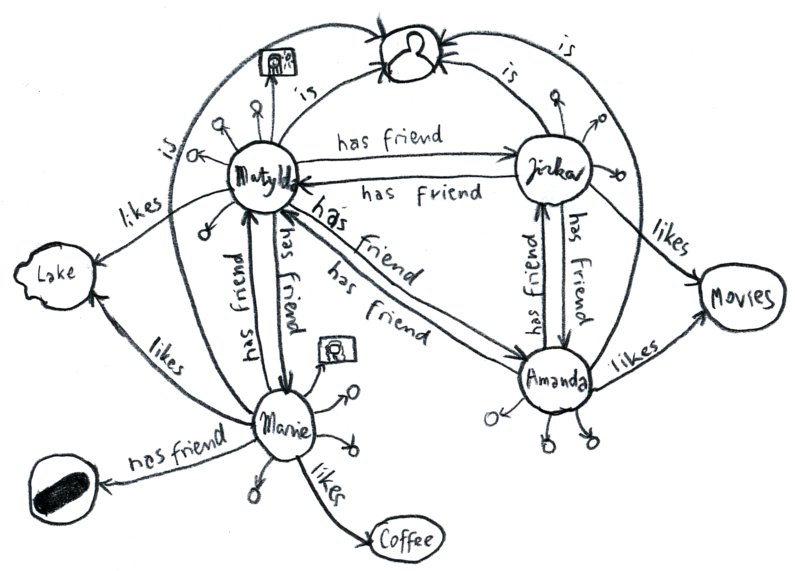

# Show my profile

_we look what's at webId * triples, triples, triples * fetch my data with inrupt library * fetch my photo * it's annoying, isn't it?_

_how we fetch user's profile data - photo, name, about_

## Intro: Look at webId

When we initialized login, we received the signed-in user's (yours) webId. It's a url which in Linked Data world represents you. It looks something like `https://myusername.solidcommunity.net/profile/card#me`. And in Linked Data world, when you go to that url, you should get some info about that person (you) in RDF format.

So we'll do just that. After app gets initialized (with `handleIncomingRedirect`), we take the webId and we look at that url (dereference it, do we call it that?). But we don't do it in simple way. We use another inrupt's library, `@inrupt/solid-client`.

This would be a prime time to talk a little bit about Linked Data, or RDF - Resource Description Framework. If you know this, skip the next section, and jump directly [here](#get-the-data).

## Triples, Triples, Triples

RDF, short for [Resource Description Framework](https://www.w3.org/TR/rdf11-concepts/). Sounds scary, doesn't it? Who comes up with these names? You want to run away and hide and cry.

But it's pretty simple. It's basically all just short sentences about somebody or something. Like a story, but with limited words.

> Something is a Human.  
> This human's name is Matylda.  
> Here's Matylda's photo: ...  
> Matylda likes lakes, trees, chocolate and gray-blue color.  
> Here's a little text about Matylda: '...........'  
> Matylda is friends with Amanda, Jirka and Marie.

How do we translate it to the terms of RDF?

First of all, we simplify each sentence into three "words". Subject, predicate, object. Who/what, having/doing what, to whom/what.

We can draw it:


If we put the separate triples together, we get a graph:


RDF is a graph like this. Now, if we put this graph together with graphs of Amanda, Jirka and Marie, we'll start seeing the Linked Data... :smile:



Secondly, in RDF, instead of words, we use URIs (similar to URLs). Weird, right? For example `likes`  in `(somebody) likes (something)` can be expressed as [`http://xmlns.com/foaf/0.1/topic_interest`](http://xmlns.com/foaf/0.1/topic_interest), or `foaf:topic_interest` for short. When we use the same URI, we know that we say the same thing. Some URIs can represent you or [the Universe](http://www.wikidata.org/entity/Q1). Many of these URIs are defined in RDF Vocabularies, and the [foaf (friend of a friend)](http://xmlns.com/foaf/0.1/) that we used just a moment ago, is a vocabulary example. You can search some of these vocabularies in [LOV](https://lov.linkeddata.es/). When you try to say something, try to use existing words (terms) to say it, if possible.

And that's RDF! Just express the world in simple sentences made of three words. Draw a simple little mind map with URIs.

In the language of computers, RDF can be written in different formats (serializations). They have names like [Turtle](https://www.w3.org/TR/turtle/), [N-Triples](https://www.w3.org/TR/n-triples/), [RDF/XML](https://www.w3.org/TR/rdf-syntax-grammar/), [JSON-LD](https://www.w3.org/TR/json-ld/), [HDT](https://www.rdfhdt.org/what-is-hdt/) and [others](https://ontola.io/blog/rdf-serialization-formats/).

Don't even try to understand RDF/XML. Also, don't bother with JSON-LD for now. If you need these, computer can [translate from one format to another](https://www.easyrdf.org/converter) for you. Remember. It's just a mind map.

But Turtle and N-Triples can be understood by humans. In Turtle our data about Matylda will look like this:

```ttl
@prefix foaf: <http://xmlns.com/foaf/0.1/>.
@prefix schema: <http://schema.org/>.
@prefix vcard: <http://www.w3.org/2006/vcard/ns#>.
@prefix wd: <http://www.wikidata.org/entity/>.

<https://id.matylda.example.com>
    a foaf:Person;
    foaf:name "Matylda";
    vcard:hasPhoto <https://matylda.example.com/photos/me.jpg>;
    foaf:topic_interest wd:Q23397, wd:Q10884, wd:Q195, wd:Q4928721;
    schema:description "This is some text about Matylda, in English"@en;
    foaf:knows
        <https://amanda.example.com/profile/card#me>,
        <https://jirka.solidcommunity.net/profile.card#me>,
        <https://solidweb.me/marie/profile/card#me>.
```

Try to see the triples there :wink:. You can also [serialize it to different formats](https://www.easyrdf.org/converter)[^converter], if you're adventurous

[^converter]:
    You can convert the turtle like this:

    - go to https://www.easyrdf.org/converter,
    - copy the turtle data to `Input Data`,
    - write `https://example.com` (or whatever) to `or URI`,
    - select `Turtle Terse RDF Triple Language` in `Input Format`,
    - select format you want to see in `Input Format`,
    - and click `Submit`.

It becomes a bit more complicated, when you want to express more interesting things. `Matylda likes lakes and gray-blue color very much, and she likes chocolate a little less.` Saying how much she likes something already makes things more complicated. People try to go around this issue, but i think RDF just sucks at expressing anything more complicated. Don't even start with stories, or poetry. RDF is not an universal language...

We'll finish our introduction to RDF here.


## Get the data!

When i dereference [my webId](https://myusername.solidcommunity.net/profile/card#me), i should find my profile with info about me. In Solid, it's going to be in Turtle format.

We used [`@inrupt/solid-client`](https://www.npmjs.com/package/@inrupt/solid-client) library for this purpose.

First let's authenticate ourselves, then fetch the personal profile document, and then find interesting data in it.[^code]

[^code]: Check out the [full implementation](https://github.com/OpenHospitalityNetwork/ohn-solid/blob/4db3bb320e2ad750042421724e2689c45c7278a3/src/features/user/userAPI.ts).

### Authenticate

In the previous chapter, [we signed in](solid-start.md#solid-inruptsolid-client-api) using [`@inrupt/solid-client-authn-browser`](https://www.npmjs.com/package/@inrupt/solid-client-authn-browser) library.

If we did that, we can simply import a `fetch` function from this library. If we do requests with this `fetch`, they will be authenticated.

```ts
import { fetch } from '@inrupt/solid-client-authn-browser'
```

### Fetch the document

```ts
import { getSolidDataset } from '@inrupt/solid-client'

const webId = 'https://myusername.solidcommunity.net/profile/card#me'
const dataset = await getSolidDataset(webId, { fetch })
```

### Extract the data

We can fetch the following, and more:

- name: [`vcard:fn`]() or [`foaf:name`]()
- photo: [`vcard:hasPhoto`]()
- info: [`vcard:note`]()

To manage vocabularies, we use a handy library `rdf-namespaces`. Thanks to this library we don't have to type the terms.

```ts
import { vcard, foaf } from 'rdf-namespaces'
```

Select myself from the dataset:

```ts
import { getThing } from '@inrupt/solid-client'

const userThing = getThing(dataset, webId)
```

Read my name, it's going to be a string

```ts
import { getStringNoLocale } from '@inrupt/solid-client'

const name: string = (getStringNoLocale(userThing, vcard.fn) || getStringNoLocale(userThing, foaf.name)) ?? ''
```

Read the url of my photo

```ts
import { getUrl } from '@inrupt/solid-client'

const photoUrl = getUrl(userThing, vcard.hasPhoto) ?? ''
```

Read the info about me, it's going to be a text in English or a string

```ts
import { getStringWithLocale } from '@inrupt/solid-client'

const about: string = (getStringNoLocale(userThing, vcard.note) || getStringWithLocale(userThing, vcard.note, 'en')) ?? ''
```

### Fetch the photo

We can show publicly accessible photos with `img`

```tsx

```

But sometimes, the image is protected.

To display such image we

1. fetch the image as blob with the authenticated `fetch` ([as explained above](#authenticate))
    ```ts
    import { fetch } from '@inrupt/solid-client-authn-browser'

    const url = 'https://myusername.solidcommunity.net/profile/photo.jpg'
    const response = await fetch(url)
    const blob = await response.blob()
    ```
1.  create object url from this blob
    ```ts
    const photo = URL.createObjectURL(blob)
    ```
1. show the image with `img` tag
    ```tsx
    
    ```

## Better?

Using the inrupt library is a bit annoying, isn't it? In my ideal world, I'd like to express what i need as graph


This is possible with SPARQL. But Solid and SPARQL are not exactly friends. We'll get to that. If you're impatient, jump [here (TODO)]().

In SPARQL, the above picture would be written like:

```
write a SPARQL query, with optional stuff...
```

[Next: Offer a Home](offer.md)
