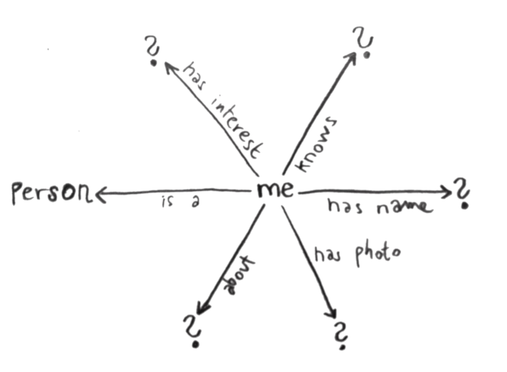

# Show user's profile

_we look what's at webId * triples, triples, triples * fetch my data with inrupt library * fetch my photo * it's annoying, isn't it?_

_how we fetch user's profile data - photo, name, about_

## Intro: Look at webId

When we initialized login, we received the signed-in user's (yours) webId. It's a url which in Linked Data world represents you. It looks something like `https://username.solidcommunity.net/profile/card#me`. And in Linked Data world, when you go to that url, you should get some info about that person (you) in RDF format.

So we'll do just that. After app gets initialized (with `handleIncomingRedirect`), we take the webId and we look at that url (dereference it, do we call it that?). But we don't do it in simple way. We use another inrupt's library, `@inrupt/solid-client`.

This would be a prime time to talk a little bit about Linked Data, or RDF - Resource Description Framework. If you know this, skip the next section, and jump directly [here](#get-the-data).

## Triples, Triples, Triples

RDF, short for Resource Description Framework. Sounds scary, doesn't it? Who comes up with these names? You want to run away and hide and cry.

But it's pretty simple. It's basically all just short sentences about somebody or something. Like a story, but with limited words.

Something is a Human.
This human's name is Matylda.
Here's Matylda's photo: ...
Matylda likes lakes, trees, chocolate and gray-blue color.
Here's a little text about Matylda: '...........'

Matylda is friends with Amanda, Jirka and Marie.

How do we translate it to the terms of RDF?

We simplify each sentence into three "words". Subject, predicate, object. Who/what, doing what, to whom/what.

We can draw this:

(draw separate triples)

(draw triples put together)

First, in rdf, instead of words, we use urls. Weird, right? For example "likes" can be expressed as `foaf url#topic_interest` or `foaf:topic\_interest` for short.

(fix! & write more about uris)

And that's RDF! Just express the world in these simple sentences made of three words. Draw a simple little mind map.

In the language of computers, RDF can be written in different formats. They have names like Turtle, N3, RDFXML, JSON-LD

Don't even try to understand RDFXML. Also, don't bother with JSON-LD for now. If you need these, you can translate from one format to another. Remember. It's just a mind map.

But Turtle and N3 can be understood by humans. In Turtle our data about Matylda will look like this:

```
Write here the whole thing in turtle.
```

It becomes a bit more complicated, when you want to express more interesting things. (todo - write about anything more complicated). People try to go around this issue, but i think RDF just sucks at expressing anything more complicated. Don't even start with stories, or poetry. RDF is not an universal language...

We'll finish our introduction to RDF here.


## Get the data!

So, let's fetch some info about me with inrupt library!


(describe how that's done) - library, authenticated fetch

## Get the photo

``

But i had a problem that my photo wasn't public. So I needed to fetch it while authenticated. (describe a bit about authentication header...)
... (how to get protected stuff with inrupt's fetch)

## Better?

Using the inrupt library is a bit annoying, isn't it? In my ideal world, I'd like to do things like



This is possible with SPARQL. But Solid and SPARQL are not exactly friends. We'll get to that. If you're impatient, jump [here (TODO)]().

In SPARQL, the above picture would be written like:

```
write a SPARQL query, with optional stuff...
```

[Next: Offer to stay at your home](offer.md)
